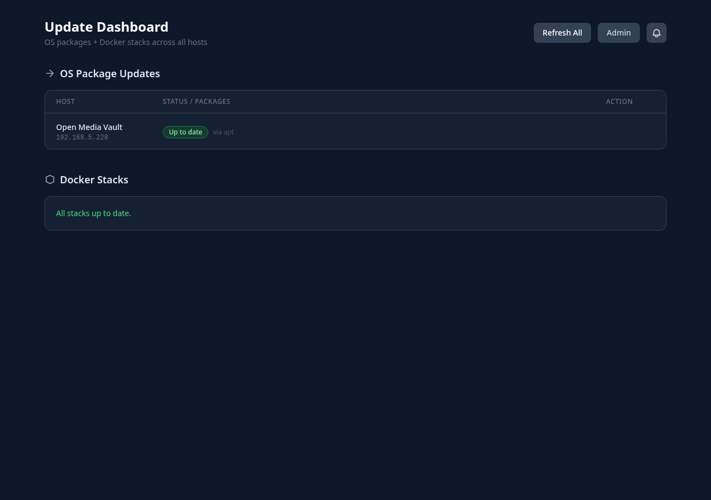
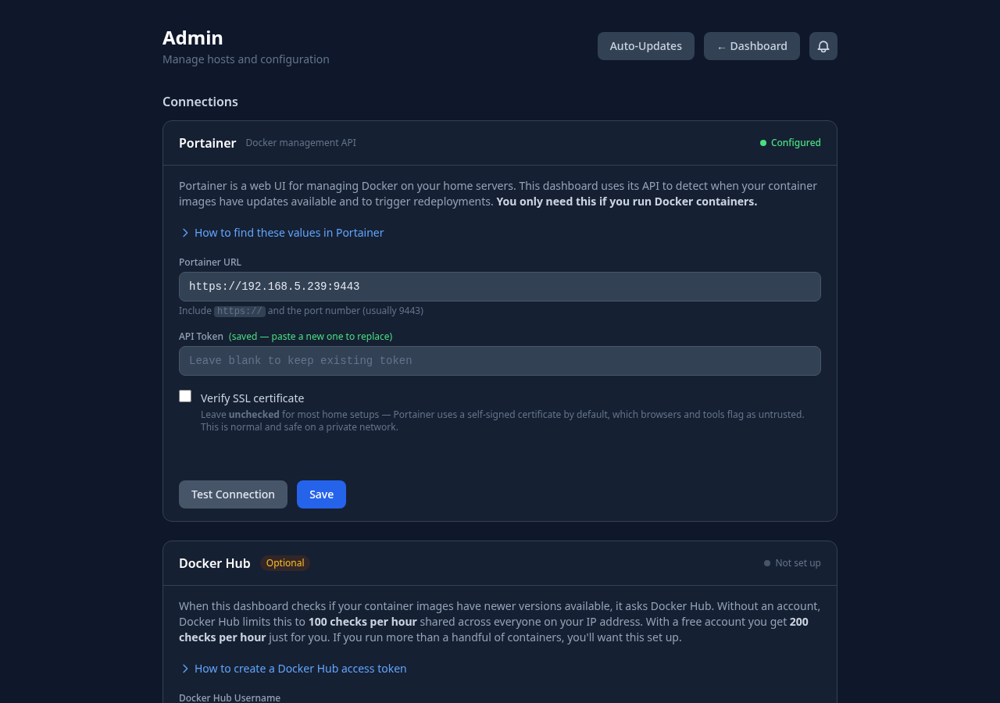
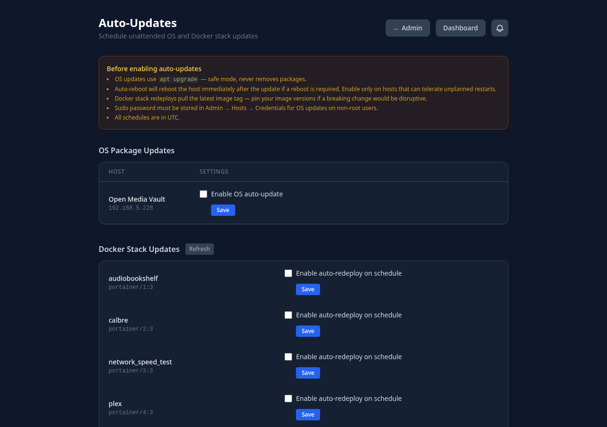

# Update Dashboard

A self-hosted dashboard for monitoring and applying OS package updates and Docker Compose stack updates across multiple Linux hosts — from a single browser tab.

Built with FastAPI + HTMX. No JavaScript frameworks, no database, no agents to install on remote hosts — just SSH.



---

## Features

- **Setup wizard** — first-run flow creates your admin account (username + password + optional 2FA), generates a backup key, and walks through adding hosts and configuring connections
- **OS package updates** — checks `apt`, `dnf`, `yum`, `zypper`, `pacman`, and `apk` via SSH; shows pending updates with version diffs
- **One-click upgrade** — runs the appropriate upgrade command remotely with live streaming output
- **Reboot detection** — shows a "Reboot required" badge and restart button after kernel/system updates
- **Docker Compose monitoring** — discovers running stacks over SSH, compares image digests against the registry to detect available updates — no Portainer or agent required
- **Portainer support** — optionally use a Portainer API as an alternative or additional Docker backend
- **One-click stack redeploy** — pulls latest images and restarts the stack
- **Auto-discovery** — after a successful connection test, the dashboard checks for running Compose stacks and asks if you want to monitor them
- **Auto-updates** — schedule unattended OS upgrades and Docker stack redeployments per host/stack with cron schedules; optional auto-reboot per host
- **Notification bell** — tracks auto-update run history; badge turns red on failure
- **Encrypted credential store** — SSH keys, passwords, sudo passwords, API keys, and tokens stored encrypted on disk; nothing sensitive ever touches `config.yml`
- **Sudo support** — non-root users are prompted for their sudo password inline, with an option to save it for future runs
- **HTTPS/TLS** — generate a self-signed cert or upload your own from **Admin → HTTPS**; the app restarts automatically
- **Single admin account** — single-user by design; all configuration is managed through the UI

---

## Quick Start

### 1. Create directories

```bash
mkdir update-dashboard && cd update-dashboard
mkdir config data
```

### 2. Create `docker-compose.yml`

```yaml
services:
  update-dashboard:
    image: ghcr.io/d4vastu/update-dashboard:latest
    container_name: update-dashboard
    ports:
      - "8765:8765"
    volumes:
      - ./config:/app/config    # config.yml — host list and SSH defaults
      - ./data:/app/data        # encrypted credentials and session secret
    restart: unless-stopped
```

### 3. Start

```bash
docker compose up -d
```

Open **http://localhost:8765** — the setup wizard will guide you through the rest.

---

## First-Run Setup Wizard

The setup wizard runs automatically the first time (when no admin account exists):

1. **Create account (1/3)** — set a username and password; optionally enroll TOTP 2FA with any authenticator app
2. **Save your backup key (2/3)** — a one-time recovery key is displayed; **copy it and store it somewhere safe before continuing** — this is the only way to reset your password if you lose access, there is no other recovery path
3. **Connect infrastructure (3/3)** — add SSH hosts, configure Portainer, set DockerHub credentials

Have ready before starting step 3: IP addresses of your hosts, SSH credentials (password or key), and optionally your Portainer URL and API token.

After finishing, you are redirected to the login page. Backup key and infrastructure settings can be updated anytime from the admin panel without re-running the full wizard.

---

## Adding Hosts



1. Go to **Admin → Hosts → Add host** — enter name, IP/hostname, SSH user (optional), and port (optional)
2. Choose **Password** or **SSH key** authentication and enter credentials
3. Click **Test connection & add host** — the dashboard verifies SSH access
4. If Docker Compose stacks are found, a prompt appears: *"We found X stacks running — want to monitor them?"* — click **Yes** or **No**

---

## SSH Authentication

Credentials are stored **encrypted** in `./data/credentials.json`. The encryption key lives at `./data/.secret`.

> **Important:** If `./data/.secret` is lost, all stored credentials become permanently unrecoverable. Back up the entire `./data/` directory, keep it secure, and never commit it to version control.

### SSH Key (recommended)

Generate a dedicated key pair and authorize it on each host:

```bash
ssh-keygen -t ed25519 -f ~/.ssh/dashboard_key -N ""
ssh-copy-id -i ~/.ssh/dashboard_key.pub user@your-host
```

Paste the private key contents into the **Credentials** form in the admin panel.

Alternatively, mount a keys directory and use the SSH default key setting:

```bash
mkdir keys
ssh-keygen -t ed25519 -f keys/id_ed25519 -N ""
ssh-copy-id -i keys/id_ed25519.pub root@your-host
```

```yaml
volumes:
  - ./keys:/app/keys:ro
```

Then set the key path in **Admin → SSH Settings → Default key** to `/app/keys/id_ed25519`.

### SSH Password

Enable `PasswordAuthentication yes` in `/etc/ssh/sshd_config` on the remote host, then enter the password in the Credentials form.

### Sudo

If your SSH user is not root, updates and reboots require `sudo`. The dashboard will prompt for the sudo password inline when needed — you can save it to avoid being prompted again. The saved sudo password is stored encrypted alongside the SSH credentials.

---

## Docker Compose Monitoring

Docker monitoring works over the same SSH connection used for OS updates — no Portainer or agent required on the remote host.

**Requirements on the remote host:**
- Docker Engine and Docker Compose v2 (`docker compose` subcommand)
- The SSH user must be root or a member of the `docker` group

**How it works:**
1. Runs `docker compose ls --all --format json` to discover stacks
2. For each running container, fetches the local image digest via `docker image inspect` and compares it against the upstream registry
3. Updates are applied with `docker compose pull && docker compose up -d`

**Notes:**
- Image digest comparison works for public images and private registries where the remote host already has pull access (the dashboard uses the remote host's Docker credentials, not its own)
- If your stack uses `image: nginx:latest`, any breaking upstream change will be detected — pin versions if that is a concern

**Monitoring modes** (set per-host):

| Mode | Behaviour |
|---|---|
| All stacks | Monitors stacks found when monitoring was first enabled |
| All + new | Always queries fresh; picks up newly added stacks automatically |
| Selected | Only monitors the stacks you explicitly choose |

### Portainer (optional)

If you already run Portainer, it can be used alongside SSH monitoring.

1. Go to **Admin → Connections → Portainer**
2. Enter the Portainer URL (e.g. `https://192.168.1.10:9443`) and paste your API token
3. Click **Test Connection**, then **Save**

To get your API token: Portainer → your username (top-right) → **Account Settings** → **Access Tokens** → **Add access token**.

---

## Auto-Updates



Schedule unattended updates in **Admin → Auto-Updates**.

**OS updates (per host):**
- Enable the toggle and set a cron schedule (all times are UTC)
- Runs the appropriate upgrade command for the detected package manager (`apt`, `dnf`, `yum`, `zypper`, `pacman`, or `apk`)
- Optionally enable auto-reboot — the host reboots immediately after the update if the system indicates a reboot is required
- Non-root hosts require a saved sudo password (set in Admin → Hosts → Credentials)
- Missed schedules (e.g. container was stopped during the window) are skipped, not queued

**Docker stack redeployments (per stack):**
- Enable the toggle and set a cron schedule
- Pulls the latest image tags and restarts the stack

**Cron schedule format** — standard 5-field cron (UTC):

```
┌─ minute (0–59)
│  ┌─ hour (0–23)
│  │  ┌─ day of month (1–31)
│  │  │  ┌─ month (1–12)
│  │  │  │  ┌─ day of week (0–7, 0 and 7 = Sunday)
│  │  │  │  │
*  *  *  *  *
```

Common examples:

| Schedule | Meaning |
|---|---|
| `0 3 * * *` | Every day at 03:00 UTC |
| `0 3 * * 0` | Every Sunday at 03:00 UTC |
| `0 3 1 * *` | First day of each month at 03:00 UTC |
| `30 2 * * 1-5` | Weekdays at 02:30 UTC |

**Notification bell:**
- Badge turns red when an auto-update job fails
- Click to view the last 20 run results and mark notifications as read

---

## HTTPS / TLS

Enable HTTPS from **Admin → HTTPS** — no manual cert or container restart required.

**Self-signed certificate (internal / home lab use):**
1. Go to **Admin → HTTPS → Self-signed certificate**
2. Enter the hostname or IP the dashboard will be reached at
3. Click **Generate & Enable** — a 2-year certificate is created, the app restarts, and the page redirects to the HTTPS URL
4. Your browser will show a security warning — add a permanent exception (the cert is only self-signed, not malicious)

> After clicking Generate, the browser will show a connection error for a few seconds while the container restarts. Wait, then reload the page at the new `https://` URL.

**Custom certificate (public-facing deployments):**
1. Go to **Admin → HTTPS → Custom certificate**
2. Paste your PEM-encoded certificate chain and private key
3. Click **Save & Enable** — the app restarts with your certificate

**Disable HTTPS:**
- **Admin → HTTPS → Disable** — removes the certificate files and reverts to HTTP on the next restart

**Reverse proxy (nginx, Caddy, Traefik):**

If you terminate TLS at a reverse proxy, leave HTTPS disabled in the app and point the proxy at `http://localhost:8765` (or whichever port you mapped). Example nginx config:

```nginx
server {
    listen 443 ssl;
    server_name dashboard.example.com;

    ssl_certificate     /etc/ssl/certs/dashboard.crt;
    ssl_certificate_key /etc/ssl/private/dashboard.key;

    location / {
        proxy_pass http://localhost:8765;
        proxy_set_header Host $host;
        proxy_set_header X-Real-IP $remote_addr;
        # Required for WebSocket / HTMX streaming
        proxy_buffering off;
        proxy_read_timeout 300s;
    }
}
```

For Caddy, the equivalent is simply:
```
dashboard.example.com {
    reverse_proxy localhost:8765
}
```

If binding directly on `0.0.0.0` is undesirable, restrict to loopback in the compose file:
```yaml
ports:
  - "127.0.0.1:8765:8765"
```

---

## Account Management

### Two-Factor Authentication (TOTP)

Enable or disable TOTP from **Admin → Account → Two-Factor Authentication**. Works with Google Authenticator, Authy, 1Password, and any standard TOTP app.

### Backup Key

A backup key is generated when your account is created. If you lose your password, go to the login page, click **Forgot password**, and enter the backup key to set a new password.

> **Store your backup key somewhere safe.** If you lose both your password and backup key, there is no account recovery — only a factory reset (which wipes all data).

Regenerate your backup key at any time from **Admin → Account → Backup Key**. The old key is invalidated immediately.

### Factory Reset

**Admin → Account → Danger Zone → Factory Reset** — wipes all in-app configuration and credentials, then redirects to the setup wizard.

Requires your current password and typing `RESET` (case-insensitive) to confirm.

**What is deleted:** all hosts, SSH credentials, Portainer config, DockerHub config, auto-update schedules, and the admin account.

**What is NOT deleted:** the `./config` and `./data` directories on disk. After a factory reset, the app writes a blank `config.yml` on next run. If you want a completely clean slate, stop the container and delete those directories manually before restarting.

---

## Connections


Configure Portainer and Docker Hub in **Admin → Connections**.

**Portainer** — connect a Portainer instance to use it as a Docker backend. Enter the URL and API token, click **Test Connection** to verify, then **Save**.

**Docker Hub** (optional) — unauthenticated pulls from Docker Hub are rate-limited. Adding a free Docker Hub account and access token gives you a higher personal rate limit for image digest lookups. Use an access token (not your password): hub.docker.com → Account Settings → Personal access tokens.

Changes take effect immediately on save — no restart needed.

---

## Upgrading

```bash
docker compose pull
docker compose up -d
```

The `./config` and `./data` volumes persist across upgrades. No migration steps are required between versions — the app reads whatever is in those directories on startup.

If you pin to a specific version tag (recommended for production):
```yaml
image: ghcr.io/d4vastu/update-dashboard:0.9.0
```

Available tags are listed on the [packages page](https://github.com/d4vastu/update-dashboard/pkgs/container/update-dashboard).

---

## Backup

Back up the `./data` directory — it contains the encrypted credential store and the encryption key.

```bash
# Stop the container first to avoid partial writes
docker compose stop
tar -czf update-dashboard-backup-$(date +%Y%m%d).tar.gz data/ config/
docker compose start
```

> **`./data/.secret` is critical.** This file is the Fernet encryption key for all stored credentials. Without it, the credential store cannot be decrypted. Store the backup in a separate location from the running container.

The `./config` directory (`config.yml`) contains no secrets and can be backed up separately or committed to version control.

---

## Logs

```bash
# Follow live logs
docker compose logs -f

# Last 100 lines
docker compose logs --tail=100
```

The app logs to stdout via uvicorn. Each request is logged with method, path, and status code. Auto-update job output is stored in `./data/auto_update_log.json` and viewable from the notification bell in the UI.

---

## config.yml Reference

`config.yml` stores host topology and SSH defaults only — no secrets. It is managed by the admin panel and lives in the `./config` volume.

```yaml
ssh:
  default_key: /app/keys/id_ed25519   # path inside the container
  default_user: root
  default_port: 22
  connect_timeout: 15
  command_timeout: 600

hosts:
  - name: "Proxmox"
    host: 192.168.1.10

  - name: "Media Server"
    host: 192.168.1.20
    user: sysadmin
    port: 22
    docker_mode: all_and_new

  - name: "Nextcloud"
    host: 192.168.1.30
    user: ubuntu
    docker_mode: selected
    docker_stacks:
      - nextcloud
      - nginx-proxy
```

**`docker_mode` values:**

| Value | Behaviour |
|---|---|
| `all` | Monitor stacks found when monitoring was enabled |
| `all_and_new` | Always query the host fresh; picks up new stacks automatically |
| `selected` | Only monitor stacks listed in `docker_stacks` |
| *(absent)* | No Docker monitoring for this host |

---

## Volumes

| Path | Contents | Secrets? |
|---|---|---|
| `./config` | `config.yml` — host list, SSH settings | No — safe to commit |
| `./data` | `credentials.json` (encrypted), `.secret` (key), session data, auto-update log | **Yes — back up and restrict access** |
| `./keys` (optional) | SSH private key files for file-based auth | **Yes — mount read-only** |

---

## Environment Variables

Only two environment variables are recognised:

| Variable | Default | Description |
|---|---|---|
| `CONFIG_PATH` | `/app/config/config.yml` | Path to `config.yml` inside the container |
| `DATA_PATH` | `/app/data` | Directory for credentials, session secret, and auto-update log |

All other configuration is managed through the UI.

---

## Architecture

```
FastAPI (Python)
├── SSH via asyncssh
│   ├── Package check / upgrade / reboot (apt, dnf, yum, zypper, pacman, apk)
│   └── Docker Compose discover / inspect / pull / up -d
├── Container backends (pluggable)
│   ├── SSHDockerBackend  — SSH + docker CLI, no agent needed
│   └── PortainerBackend  — Portainer REST API via httpx
├── Auto-update scheduler (APScheduler)
│   ├── Per-host OS upgrade jobs with optional auto-reboot
│   └── Per-stack Docker redeploy jobs
├── Encrypted credential store (Fernet / AES-128)
│   └── SSH keys, passwords, sudo passwords, API tokens — never in config.yml
└── HTMX frontend — server-rendered partials, no page reloads, no JS framework
```

---

## Development

```bash
git clone https://github.com/d4vastu/update-dashboard.git
cd update-dashboard
pip install -r requirements.txt -r requirements-dev.txt

DATA_PATH=./data uvicorn app.main:app --reload --port 8000
```

Run tests:

```bash
pytest --cov=app --cov-fail-under=95
```

The test suite uses isolated temp directories for config and credentials — no real SSH connections are made.

---

## License

MIT
