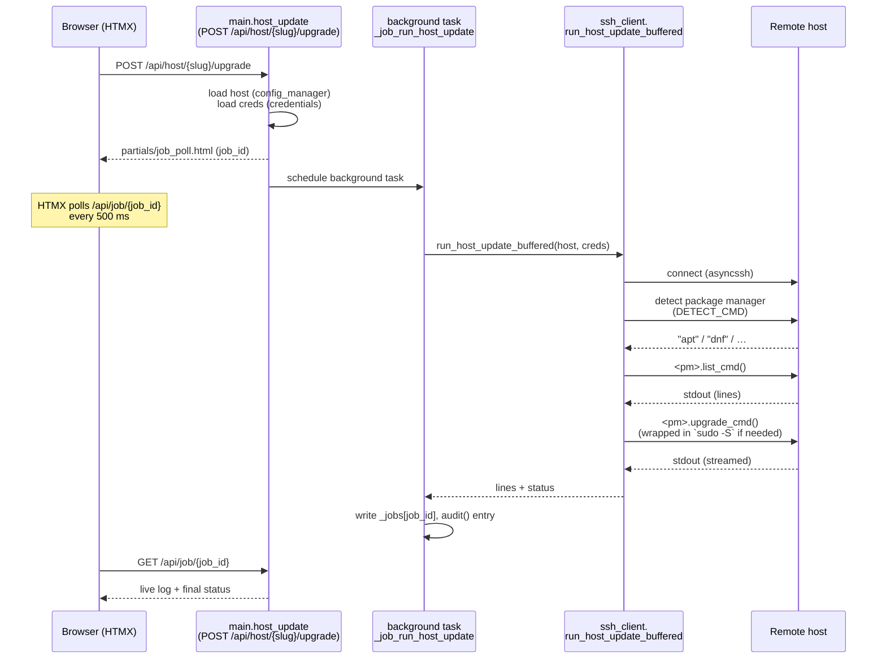

# Keepup Architecture

A contributor-facing tour of the codebase. Read this when you want to add a
package manager, a container backend, an infrastructure integration, or a new
admin screen — and want to know which file to start in.

For end-user docs (install, configure, run), see the [README](../README.md).

---

## What Keepup is, technically

A single FastAPI process that:

- Stores host topology in a YAML file (`config.yml`) and secrets in a
  Fernet-encrypted JSON blob (`credentials.json`).
- Talks to Linux hosts over SSH (asyncssh), to Docker registries over HTTPS,
  and to optional infrastructure APIs (Proxmox VE, Portainer, …) over HTTPS.
- Renders server-side HTML and ships interactivity via HTMX — no JavaScript
  framework, no API consumed by a separate front-end.
- Schedules unattended OS upgrades and Docker stack redeploys with
  APScheduler.

There is no database. State is files on disk. There are no agents to install
on remote hosts — just SSH.

---

## Module map of `app/`

Grouped by role. One line per file.

### Routing & entry

| File | Role |
| --- | --- |
| `main.py` | FastAPI app construction, dashboard routes, host/stack action endpoints, job polling, version check |
| `auth_router.py` | Login, setup wizard, MFA enrolment, backup-key recovery |
| `admin.py` | Admin panel — hosts CRUD, integrations, SSH defaults, TLS upload, settings |
| `auto_updates_router.py` | Per-host / per-stack schedule editor (cron expressions, enable/disable) |

### Auth & sessions

| File | Role |
| --- | --- |
| `auth.py` | Single-admin account: bcrypt password hash, TOTP MFA, session-version field, backup-key generation |
| `csrf.py` | CSRF token middleware for HTMX state-changing requests |
| `security_headers.py` | HSTS, `X-Frame-Options`, optional HTTPS redirect |

### Config & secrets

| File | Role |
| --- | --- |
| `config_manager.py` | `config.yml` loader/saver — hosts, SSH defaults, integration endpoints |
| `credentials.py` | Fernet-encrypted credential store (SSH keys/passwords, sudo passwords, integration tokens, admin account) |
| `ssl_manager.py` | TLS cert/key persistence, self-signed cert generation |

### Container backends

| File | Role |
| --- | --- |
| `backends/protocol.py` | `ContainerBackend` runtime-checkable protocol (3 surface points) |
| `backends/ssh_docker_backend.py` | SSH + `docker compose` CLI on each host (no agent) |
| `backends/portainer_backend.py` | Portainer REST API |
| `backend_loader.py` | Reads config + credentials, instantiates the active backends, hands the list to scheduler/router |

### Infrastructure clients

| File | Role |
| --- | --- |
| `proxmox_client.py` | Proxmox VE API — version check, node/VM/LXC discovery, IP resolution, reboot |
| `portainer_client.py` | Portainer API — endpoints, stacks, redeploy with registry digest comparison |
| `registry_client.py` | Docker registry digest lookup (Docker Hub, ghcr.io, lscr.io, custom) for Compose update detection |
| `httpx_client.py` | Async HTTPX factory with per-host circuit breakers (`aiobreaker`) and pinned-cert SSL contexts |
| `cert_utils.py` | TOFU certificate pinning — fetch, fingerprint, build pinned `SSLContext` |

### SSH & package managers

| File | Role |
| --- | --- |
| `ssh_client.py` | asyncssh wrapper — connection, sudo, command timeouts, package-manager detection, buffered host-update runner |
| `package_managers.py` | Registry of OS package managers — `apt`, `dnf`, `yum`, `zypper`, `pacman`, `apk` (+ `Unknown` fallback) |

### Updates & scheduling

| File | Role |
| --- | --- |
| `auto_update_scheduler.py` | APScheduler-backed cron runner; applies OS and stack jobs, logs results, fires notifications |
| `auto_update_log.py` | Append-only JSON log (cap 100 entries, 50 lines/entry) at `data/auto_update_log.json` |
| `update_check_cache.py` | In-memory TTL cache for host update checks |
| `update_notifier.py` | Dedup store at `data/notified_updates.json` so the same update isn't notified twice |

### Notifications & observability

| File | Role |
| --- | --- |
| `notifications.py` | In-memory + persisted notifications (cap 50, read flag); fires Pushover async |
| `pushover.py` | Pushover Net API client |
| `audit.py` | Rotating audit log (10 MB × 5 backups) at `data/audit.log` |
| `log_buffer.py` | Circular in-memory buffer (500 lines) capturing uvicorn + app logs for `Admin → Logs` |

### Templates & utilities

| File | Role |
| --- | --- |
| `templates_env.py` | Jinja2 environment factory + timezone filter |
| `rate_limiter.py` | SlowAPI limiter (per remote address) |
| `self_identity.py` | Detect "this container" so Keepup never reboots its own Proxmox host out from under itself |
| `__version__.py`, `__init__.py` | Version string and package marker |

---

## Pluggable container backends

The protocol is intentionally small — three things in
`app/backends/protocol.py`:

```python
class ContainerBackend(Protocol):
    BACKEND_KEY: str  # opaque id, e.g. "ssh", "portainer"

    async def get_stacks_with_update_status(
        self, dockerhub_creds: dict | None = None,
    ) -> list[dict]: ...

    async def update_stack(self, ref: str) -> None: ...
```

`ref` is a backend-defined identifier the dashboard treats as opaque. SSH uses
`"{project}:{container_name}"` (or `"~{container_name}"` for standalone
containers). Portainer uses `"{stack_id}:{endpoint_id}"`.

**Selection** is in `app/backend_loader.py`. `reload_backends()` is called at
startup and whenever Portainer config is saved. It instantiates
`PortainerBackend` only if both the URL and API key are present, then always
appends `SSHDockerBackend()`. The resulting list is propagated to
`auto_update_scheduler` and `auto_updates_router` for job execution.

**To add a third backend:**

1. New file under `app/backends/` (e.g. `nomad_backend.py`).
2. Class with `BACKEND_KEY: str`, `async get_stacks_with_update_status(...)`,
   `async update_stack(ref)`.
3. In `backend_loader.reload_backends()`, fetch its config + credentials and
   append an instance to the returned list (gate on whether the integration is
   configured).
4. Add a credentials slot in `credentials.py` if it needs secrets, and an
   admin form in `app/templates/admin_*.html` + route in `admin.py`.

---

## Adding a package manager

`app/package_managers.py` holds a `_REGISTRY` dict and a `get_package_manager`
dispatcher. Each manager subclasses `PackageManager` and implements:

- `list_cmd(refresh: bool) -> str` — shell command that lists available updates.
- `upgrade_cmd() -> str` — non-interactive upgrade command.
- `parse(stdout: str) -> tuple[list[Package], bool]` — parses the `list_cmd`
  output into `[{"name", "current", "available"}]` plus a `reboot_required`
  flag.

Detection happens via a chained `command -v` probe (`DETECT_CMD`) that prints
the first manager found. To add `xbps`:

1. Subclass `PackageManager`, set `name = "xbps"`, fill in the three methods.
2. Add `"xbps": XbpsPackageManager()` to `_REGISTRY`.
3. Append `command -v xbps-install` to `DETECT_CMD`.
4. Add a parser test in `tests/` covering a representative `xbps-install -Sun`
   output.

---

## Adding an infrastructure integration

The current integrations split into two camps:

- **Active** — `proxmox_client.py`, `portainer_client.py`, `registry_client.py`
  do real work (discovery, redeploys, digest checks).
- **Configured-only** — OPNsense, pfSense, Home Assistant accept credentials
  and a connection test today; their dashboard surfaces are still being built.

The active clients share a pattern:

1. **HTTP client** via `app/httpx_client.py` — `make_breaker_client(host_id)`
   returns an HTTPX `AsyncClient` wrapped in a per-host circuit breaker
   (`aiobreaker`, default 5 fails / 60 s window). Pass `pinned_cert_pem` if
   the integration is on a self-signed cert (TOFU pinning is built in
   `cert_utils.build_pinned_ssl_ctx`).
2. **Credentials** via `credentials.get_integration_credentials("name")` — the
   slot is keyed by integration name and stored Fernet-encrypted on disk.
3. **Connection config** (URL, optional cert PEM) via `config_manager` — lives
   in `config.yml`, no secrets.
4. **Routes** in `admin.py` for the credential form + connection-test endpoint;
   templates under `app/templates/admin_*.html`.

A new integration follows the same four-step pattern: HTTP client wrapper,
credential slot, config keys, admin UI.

---

## Storage layout

Two on-disk volumes, one safe to commit, one not:

| Path | What lives there | Sensitive? |
| --- | --- | --- |
| `./config/config.yml` | Hosts, SSH defaults, integration URLs, Docker monitoring modes | No — safe to commit |
| `./data/.secret` | Fernet master key for the credential store | **Yes** — irrecoverable if lost |
| `./data/.session_secret` | Session-cookie HMAC secret (overrideable via `KEEPUP_SESSION_SECRET`) | Yes |
| `./data/credentials.json` | Encrypted: SSH keys, SSH passwords, sudo passwords, integration tokens, admin bcrypt hash, TOTP secret, backup-key hash | Yes (encrypted at rest) |
| `./data/ssl/cert.pem`, `key.pem` | TLS cert + private key (self-signed or uploaded) | Yes |
| `./data/audit.log` | Rotating audit log (10 MB × 5) | Operational |
| `./data/auto_update_log.json` | Auto-update job history (cap 100 entries) | Operational |
| `./data/notifications.json` | In-app notification feed (cap 50) | Operational |
| `./data/notified_updates.json` | Dedup state for "this Compose update was already announced" | Operational |

Paths are resolved from `CONFIG_PATH` (default `/app/config/config.yml`) and
`DATA_PATH` (default `/app/data`). These are the only two environment
variables the app reads — everything else is in the UI.

---

## Request lifecycle — "user clicks Upgrade for one host"

A representative end-to-end flow. The sequence diagram below is for the SSH
case (the Proxmox VM/LXC and Proxmox-node cases branch off in
`main.host_update()` and end up using `pct exec` or the Proxmox API instead of
direct SSH).



Key call sites:

- Route handler — `app/main.py` `host_update()`.
- Background job — `app/main.py` `_job_run_host_update()`.
- SSH execution — `app/ssh_client.py` `run_host_update_buffered()` /
  `_run()` (asyncssh).
- Response partial — `app/templates/partials/job_poll.html`.

The same shape is used for Compose stack redeploys (route delegates to a
backend's `update_stack(ref)`) and OS auto-updates (APScheduler invokes the
same `run_host_update_buffered` from `auto_update_scheduler.py`).

---

## Where to look for…

| Want to do this | Start here |
| --- | --- |
| Add an admin screen | `app/admin.py` + `app/templates/admin_*.html` |
| Add a config field | `app/config_manager.py` (loader/saver) + the relevant admin form |
| Add a credential slot | `app/credentials.py` (`get_integration_credentials`/`save_…`) |
| Run a command on a host | `app/ssh_client.py` (`_connect`, `_run`) |
| Speak to a new HTTP API | wrap `httpx_client.make_breaker_client(...)` |
| Schedule something cron-ish | `app/auto_update_scheduler.py` |
| Surface a UI partial via HTMX | template under `app/templates/partials/`, route returns it |
